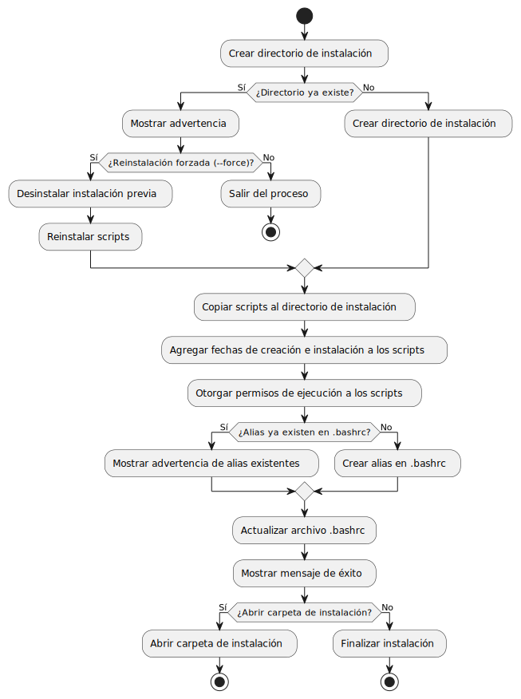

# Manager Repo 

**Versión 6.0.1** - Paquete de instalación para uso global.

Este script ha sido diseñado para optimizar la gestión de múltiples repositorios y microfrontends (Mf), permitiendo la ejecución de tareas comunes como iniciar, clonar o detener microfrontends de manera eficiente.

---

## Características Principales

- Gestión centralizada de múltiples repositorios mediante un archivo de configuración (`listRep.txt`).
- Instalación y actualización de dependencias en paralelo.
- Ejecución y monitoreo de microfrontends.
- Comandos para detener procesos y liberar recursos del sistema.
- Configuración simplificada y personalizable.

---

## Requisitos

>[!IMPORTANT]
> **El script debe ejecutarse desde la línea de comandos.**
> 
> Ejemplo:
> ```bash
> sh manager_install.sh
> ```

1. **Dependencias necesarias**:
   - `npm`
   - `git`

2. **Permisos de ejecución**:
   Es necesario asegurarse de que los scripts tengan permisos de ejecución:
   ```bash
   chmod +x *.sh
   ```

---

## Instalación de la Herramienta

El script `manager_install.sh` automatiza la instalación de la herramienta `mfs` y configura un alias global para facilitar su uso desde cualquier ubicación.

### Pasos de Instalación

1. Ejecutar el script de instalación:
   ```bash
   ./manager_install.sh
   ```

2. Una vez completada la instalación, el alias `mfs` estará disponible para ejecutar los comandos de la herramienta.

>[!NOTE]
> En caso de que el script no tenga permisos de ejecución, estos pueden otorgarse con el siguiente comando:
> ```bash
> chmod +x manager_install.sh
> ```

---

## Archivo de Repositorios (`listRep.txt`)

El archivo `listRep.txt` actúa como el núcleo de configuración de la herramienta `mfs`. Contiene las URLs de los repositorios que serán gestionados.

### Formato del Archivo

- Cada línea debe incluir una URL de repositorio.
- Las líneas que comienzan con `#` serán tratadas como comentarios.
- Etiquetas disponibles:
  - `#NEW`: Abre el repositorio en una nueva ventana de terminal.
  - `#EXCLUDE`: Excluye el repositorio de las operaciones.
- Es posible agregar comandos específicos al final de la URL.

**Ejemplo**:
```text
https://github.com/usuario/repo1.git #NEW
https://github.com/usuario/repo2.git
https://github.com/usuario/repo3.git #EXCLUDE
https://github.com/usuario/repo4.git npm run dev #NEW
```

>[!NOTE]
> Es importante asegurarse de que no haya espacios al final de cada URL y que la última línea del archivo contenga un salto de línea.

---

## Comandos Disponibles

| Comando                  | Descripción                                      |
|--------------------------|--------------------------------------------------|
| `mfs help`               | Muestra ejemplos de uso y documentación básica. |
| `mfs list`               | Crea o edita el archivo `listRep.txt`.          |
| `mfs pull listRep.txt`   | Clona o actualiza los repositorios especificados.|
| `mfs run`                | Ejecuta los microfrontends configurados.        |
| `mfs install listRep.txt`| Instala las dependencias de los repositorios.   |
| `mfs updeps listRep.txt` | Actualiza las dependencias de los repositorios. |
| `mfs ps`                 | Lista los procesos en ejecución.                |
| `mfs kill`               | Detiene todos los procesos de Node.js activos.  |
| `mfs uninstall`          | Desinstala la herramienta y elimina configuraciones.|

>[!WARNING]
> El comando `mfs list` sobrescribirá el contenido existente del archivo `listRep.txt`. Se recomienda realizar un respaldo si contiene información importante.

---

## Ejemplos de Uso

### Clonar o Actualizar Repositorios (Historial Parcial)
```bash
mfs pull listRep.txt
```

>[!NOTE]
> Para obtener el historial completo ir al respositorio en cuestion y usar :
> ```bash
> git pull --unshallow
> ```

### Usar una Rama Personalizada
```bash
mfs -b fix/branch pull listRep.txt
```
- Si no se especifica una rama, se utilizará `main` como valor predeterminado.

### Instalar Dependencias
```bash
mfs install listRep.txt
```

### Ejecutar Microfrontends
```bash
mfs run
```

### Actualizar Dependencias
```bash
mfs updeps listRep.txt
```

### Listar Procesos en Ejecución
```bash
mfs ps
```

### Detener Procesos en Ejecución
```bash
mfs kill
```
>[!TIP]
> Utilice el comando `mfs help` para acceder a ejemplos de uso y documentación básica.
>
>

---
---

>[!TIP] Notas Adicionales
- Si no se proporciona un archivo al ejecutar un comando, el script buscará uno llamado `listRep.txt` en el directorio actual.
- Si no se encuentra el archivo, se mostrará un mensaje de error y la ejecución se detendrá.
- Para especificar un archivo diferente, proporcione la ruta completa como segundo argumento.

- Asi `mfs run  ../repos/archivo.txt`  
 

- **Activar o desactivar bordes en los mensajes de salida**:
  ```bash
  mfs border
  Mostrar bordes? (true/false): true
  ```
 
- **Eliminar carpetas `node_modules` innecesarias**:
  ```bash
  npx npkill
  ```

- **Remover archivos no rastreados**:
  ```bash
  git clean -fn
  ```

- **Liberar un puerto específico**:
  ```bash
  npx kill-port 4200
  ```
---
---
>[!CAUTION] Desinstalación de la Herramienta

>[!CAUTION]
> Este comando eliminará todas las configuraciones asociadas a la herramienta `mfs`. Se recomienda respaldar cualquier archivo importante antes de proceder.
> ```bash
> mfs uninstall
> ```

>[!NOTE]Clonar e instalar 
>Copiar estos comandos 
>```bash 
>git clone --depth=1 https://github.com/noxopio/manager_scripts.git
>mv manager_scripts/Manager_install .
>rm -rf  manager_scripts 
>cd Manager_install
>chmod +x *.sh
>sh manager_install.sh
>```

----


>[!NOTE]Flujo de instalación 
><div align="center" >
>
>
>
></div>